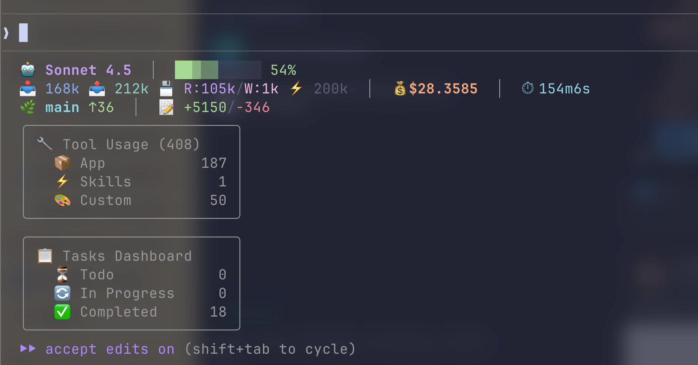

# cc-hud-go

A Go-based statusline tool for [Claude Code](https://code.claude.com) that displays rich, real-time information about your current Claude Code session.

[](https://github.com/huyhandes/cc-hud-go/actions/workflows/ci.yml)
[](https://github.com/huyhandes/cc-hud-go/actions/workflows/release.yml)
[](https://golang.org)
[](https://goreportcard.com/report/github.com/huyhandes/cc-hud-go)
[](LICENSE)
[](https://github.com/huyhandes/cc-hud-go/releases/latest)



## Features

### 📊 Real-time Metrics
- **Model Information** - Current Claude model and plan type
- **Context Usage** - Token usage with color-coded thresholds (green/yellow/red)
- **Rate Limits** - 7-day API usage tracking with visual warnings
- **Session Stats** - Duration and token processing speed

### 🔧 Development Insights
- **Git Integration** - Branch name, dirty files, ahead/behind status, file stats
- **Tool Tracking** - Categorized tool usage (App/Internal/Custom/MCP/Skills)
- **Task Progress** - Task completion tracking (completed/total)
- **Agent Activity** - Active agent name and current task description

### ⚙️ Flexible Configuration
- **Multiple Presets** - Full, Essential, and Minimal display modes
- **Granular Control** - Enable/disable individual segments
- **Customizable Thresholds** - Configure warning levels for context and rate limits
- **JSON Configuration** - Easy configuration via `~/.claude/cc-hud-go/config.json`

## Installation

### Pre-built Binaries

Download pre-built binaries from the [latest release](https://github.com/huyhandes/cc-hud-go/releases/latest):

```bash
# Linux (amd64)
wget https://github.com/huyhandes/cc-hud-go/releases/latest/download/cc-hud-go-linux-amd64.tar.gz
tar -xzf cc-hud-go-linux-amd64.tar.gz
sudo mv cc-hud-go-linux-amd64 /usr/local/bin/cc-hud-go

# macOS (Apple Silicon)
wget https://github.com/huyhandes/cc-hud-go/releases/latest/download/cc-hud-go-darwin-arm64.tar.gz
tar -xzf cc-hud-go-darwin-arm64.tar.gz
sudo mv cc-hud-go-darwin-arm64 /usr/local/bin/cc-hud-go

# macOS (Intel)
wget https://github.com/huyhandes/cc-hud-go/releases/latest/download/cc-hud-go-darwin-amd64.tar.gz
tar -xzf cc-hud-go-darwin-amd64.tar.gz
sudo mv cc-hud-go-darwin-amd64 /usr/local/bin/cc-hud-go
```

Available builds:
- Linux: `amd64`, `arm64`
- macOS: `amd64`, `arm64`
- Windows: `amd64`, `arm64`

### From Source

```bash
# Clone the repository
git clone git@github.com:huyhandes/cc-hud-go.git
cd cc-hud-go

# Build the binary
go build -o cc-hud-go .

# Move to PATH (optional)
sudo mv cc-hud-go /usr/local/bin/
```

### Using Go Install

```bash
go install github.com/huyhandes/cc-hud-go@latest
```

## Usage

### Integration with Claude Code

Add to your Claude Code statusline configuration:

```json
{
  "statusline": {
    "command": "cc-hud-go"
  }
}
```

The tool reads session data from stdin (provided by Claude Code) and outputs formatted JSON to stdout.

### Standalone Usage

For testing or development:

```bash
# With stdin data
echo '{"model":"claude-sonnet-4.5","context":{"used":5000,"total":10000}}' | cc-hud-go

# View help
cc-hud-go --help
```

## Configuration

### Configuration File

Create `~/.claude/cc-hud-go/config.json`:

```json
{
  "preset": "full",
  "lineLayout": "expanded",
  "pathLevels": 2,
  "contextValue": "percentage",
  "sevenDayThreshold": 80,
  "display": {
    "model": true,
    "path": true,
    "context": true,
    "git": true,
    "tools": true,
    "agents": true,
    "tasks": true,
    "rateLimits": true,
    "duration": true,
    "speed": true
  },
  "git": {
    "showBranch": true,
    "showDirty": true,
    "showAheadBehind": true,
    "showFileStats": true
  },
  "tools": {
    "groupByCategory": true,
    "showTopN": 5,
    "showSkills": true,
    "showMCP": true
  }
}
```

### Presets

**Full** (default) - All features enabled
```json
{
  "preset": "full"
}
```

**Essential** - Core metrics only
```json
{
  "preset": "essential"
}
```

**Minimal** - Minimal information
```json
{
  "preset": "minimal"
}
```

### Configuration Options

| Option | Type | Default | Description |
|--------|------|---------|-------------|
| `preset` | string | `"full"` | Preset configuration: `full`, `essential`, or `minimal` |
| `lineLayout` | string | `"expanded"` | Layout style: `expanded` or `compact` |
| `pathLevels` | int | `2` | Number of directory levels to show (1-3) |
| `contextValue` | string | `"percentage"` | Context display format |
| `sevenDayThreshold` | int | `80` | Warning threshold for 7-day rate limit (0-100) |

#### Display Options

All boolean flags to enable/disable segments:
- `model` - Show model name and plan type
- `path` - Show current working directory
- `context` - Show token usage
- `git` - Show git information
- `tools` - Show tool usage statistics
- `agents` - Show active agent information
- `tasks` - Show task progress
- `rateLimits` - Show API rate limit usage
- `duration` - Show session duration
- `speed` - Show token processing speed

#### Git Options

- `showBranch` - Display current git branch
- `showDirty` - Show count of dirty files
- `showAheadBehind` - Show commits ahead/behind remote
- `showFileStats` - Show added/modified/deleted file counts

#### Tools Options

- `groupByCategory` - Group tools by category (App/MCP/Skills/Custom)
- `showTopN` - Number of top tools to display (0 = all)
- `showSkills` - Include skill usage in tool counts
- `showMCP` - Include MCP tool usage in tool counts

## Architecture

### Project Structure

```
cc-hud-go/
├── config/          # Configuration management
│   ├── config.go
│   └── config_test.go
├── state/           # Session state tracking
│   ├── state.go
│   └── state_test.go
├── parser/          # Input parsing (stdin & transcript)
│   ├── parser.go
│   ├── stdin_test.go
│   └── transcript_test.go
├── segment/         # Display segments
│   ├── segment.go   # Segment interface & registry
│   ├── model.go     # Model segment
│   ├── context.go   # Context segment
│   ├── git.go       # Git segment
│   ├── tools.go     # Tools segment
│   ├── tasks.go     # Tasks segment
│   ├── agent.go     # Agent segment
│   ├── ratelimit.go # Rate limit segment
│   └── *_test.go
├── output/          # JSON output renderer
│   ├── renderer.go
│   └── renderer_test.go
├── internal/
│   ├── git/         # Git integration
│   └── watcher/     # File watching utilities
├── main.go          # Application entry point
└── go.mod
```

### Key Components

**Segments** - Modular display components implementing the `Segment` interface:
```go
type Segment interface {
    ID() string
    Render(s *state.State, cfg *config.Config) (string, error)
    Enabled(cfg *config.Config) bool
}
```

**State** - Centralized session state with automatic derived field calculation

**Parser** - Dual parsing system:
- Stdin parser for Claude Code session data (JSON)
- Transcript parser for tool usage tracking (JSONL)

**Renderer** - JSON output formatter for Claude Code statusline API

### Design Principles

Built with the [Charm](https://charm.sh) ecosystem:
- Event-driven architecture using [Bubble Tea](https://github.com/charmbracelet/bubbletea)
- Clean, elegant terminal styling with [Lipgloss](https://github.com/charmbracelet/lipgloss)
- Composable segment architecture
- Graceful degradation (missing config → defaults)
- Comprehensive test coverage with TDD approach

## Development

### Prerequisites

- Go 1.24 or higher
- Git

### Setup

```bash
# Clone repository
git clone git@github.com:huyhandes/cc-hud-go.git
cd cc-hud-go

# Install dependencies
go mod download

# Run tests
go test ./...

# Build
go build -o cc-hud-go .
```

### Creating a Release

The project uses GitHub Actions for automated releases:

```bash
# Create and push a version tag
git tag -a v1.0.0 -m "Release v1.0.0"
git push origin v1.0.0
```

This will trigger the release workflow which:
1. Builds binaries for all supported platforms (Linux, macOS, Windows)
2. Supports both `amd64` and `arm64` architectures
3. Creates compressed archives (`.tar.gz` for Unix, `.zip` for Windows)
4. Generates SHA256 checksums
5. Creates a GitHub release with auto-generated release notes
6. Uploads all artifacts to the release

You can also trigger a release manually from the Actions tab on GitHub.

### Running Tests

```bash
# All tests
go test ./...

# With coverage
go test -cover ./...

# Integration tests
go test -tags=integration -v .

# Specific package
go test ./segment -v

# Specific test
go test -run TestModelSegment ./segment
```

### Code Quality

```bash
# Format code
go fmt ./...

# Vet code
go vet ./...

# Lint (requires golangci-lint)
golangci-lint run
```

## Inspiration

This project draws inspiration from:
- [claude-hud](https://github.com/jarrodwatts/claude-hud) - Original HUD implementation
- [Oh My Posh Claude Segment](https://ohmyposh.dev/docs/segments/cli/claude) - Claude segment for Oh My Posh
- [Bubble Tea](https://github.com/charmbracelet/bubbletea) - TUI framework philosophy
- [Gum](https://github.com/charmbracelet/gum) - CLI interaction patterns

## Contributing

Contributions are welcome! Please feel free to submit a Pull Request.

### Development Workflow

1. Fork the repository
2. Create a feature branch (`git checkout -b feature/amazing-feature`)
3. Make your changes
4. Run tests (`go test ./...`)
5. Commit your changes (`git commit -m 'Add amazing feature'`)
6. Push to the branch (`git push origin feature/amazing-feature`)
7. Open a Pull Request

### Adding New Segments

1. Create `segment/<name>.go` implementing the `Segment` interface
2. Add corresponding test file `segment/<name>_test.go`
3. Register in `segment/segment.go` `All()` function
4. Add configuration option in `config/config.go` if needed
5. Update README with new segment documentation

## License

MIT License - see [LICENSE](LICENSE) file for details

## Links

- [Claude Code Documentation](https://code.claude.com/docs)
- [Claude Code Statusline API](https://code.claude.com/docs/en/statusline)
- [Issue Tracker](https://github.com/huyhandes/cc-hud-go/issues)

---

Built with ❤️ using [Go](https://golang.org) and [Charm](https://charm.sh)
