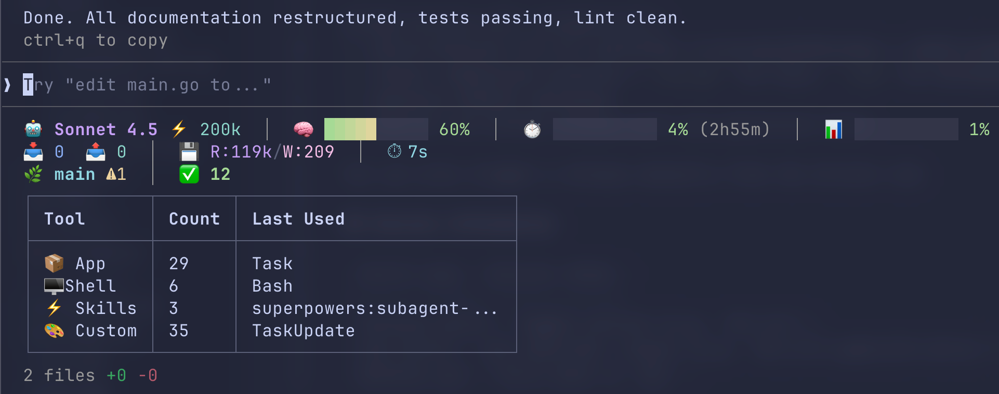

# cc-hud-go

A Go-based statusline tool for [Claude Code](https://code.claude.com) that displays rich, real-time information about your current Claude Code session.

[](https://github.com/huyhandes/cc-hud-go/actions/workflows/ci.yml)
[](https://github.com/huyhandes/cc-hud-go/actions/workflows/release.yml)
[](https://golang.org)
[](https://goreportcard.com/report/github.com/huyhandes/cc-hud-go)
[](LICENSE)
[](https://github.com/huyhandes/cc-hud-go/releases/latest)



## Features

- **Model & Context** — Model name, plan type, token usage with color-coded thresholds
- **Rate Limits** — 5-hour and 7-day API usage tracking
- **Cost & Duration** — Session cost (USD), duration, token speed
- **Git** — Branch, dirty files, ahead/behind, file stats
- **Tools** — Categorized usage (App / MCP / Skills / Custom)
- **Tasks** — Completion progress (pending / in-progress / done)
- **Agents** — Active agent name and current task

## Quick Install

```bash
# macOS (Apple Silicon)
curl -L https://github.com/huyhandes/cc-hud-go/releases/latest/download/cc-hud-go-darwin-arm64.tar.gz | tar xz
sudo mv cc-hud-go-darwin-arm64 /usr/local/bin/cc-hud-go

# macOS (Intel)
curl -L https://github.com/huyhandes/cc-hud-go/releases/latest/download/cc-hud-go-darwin-amd64.tar.gz | tar xz
sudo mv cc-hud-go-darwin-amd64 /usr/local/bin/cc-hud-go

# Linux (amd64)
curl -L https://github.com/huyhandes/cc-hud-go/releases/latest/download/cc-hud-go-linux-amd64.tar.gz | tar xz
sudo mv cc-hud-go-linux-amd64 /usr/local/bin/cc-hud-go
```

See [Build Guide](docs/BUILD_GUIDE.md) for all platforms and building from source.

## Usage

Add to your Claude Code statusline config:

```json
{
  "statusline": {
    "command": "cc-hud-go"
  }
}
```

Test standalone:

```bash
echo '{"model":"claude-sonnet-4.5","context":{"used":5000,"total":10000}}' | cc-hud-go
cc-hud-go --help
cc-hud-go --version
```

## Configuration

Create `~/.claude/cc-hud-go/config.json`:

```json
{
  "theme": "macchiato"
}
```

See [Configuration Reference](docs/CONFIG.md) for all options.

## Themes

4 [Catppuccin](https://github.com/catppuccin/catppuccin) themes: `macchiato` (default), `mocha`, `frappe`, `latte`.

```json
{ "theme": "mocha" }
```

See [Color Scheme Guide](docs/COLOR_SCHEME.md) for theme details and custom color overrides.

## Reference

| Document | Description |
|----------|-------------|
| [Build Guide](docs/BUILD_GUIDE.md) | Install, build, test, release |
| [Configuration Reference](docs/CONFIG.md) | All config options and presets |
| [Color Scheme Guide](docs/COLOR_SCHEME.md) | Themes and color customization |
| [Code Map](docs/CODEMAP.md) | Architecture and package dependencies |

## Architecture

Composable segment system: each display element is an independent `Segment` implementing `Render(state, config) (string, error)`. State flows: stdin JSON → parser → state → segments → JSON output.

See [Code Map](docs/CODEMAP.md) for full package structure and dependency graph.

## Contributing

1. Fork → feature branch → `just check` → PR
2. New segments: `segment/<name>.go` + test + register in `segment/segment.go`
3. See [CLAUDE.md](CLAUDE.md) for dev workflow

## License

MIT — see [LICENSE](LICENSE)

## Links

- [Statusline API docs](https://code.claude.com/docs/en/statusline)
- [Issue tracker](https://github.com/huyhandes/cc-hud-go/issues)
- [Releases](https://github.com/huyhandes/cc-hud-go/releases)

---

Built with ❤️ using [Go](https://golang.org) and [Charm](https://charm.sh)
